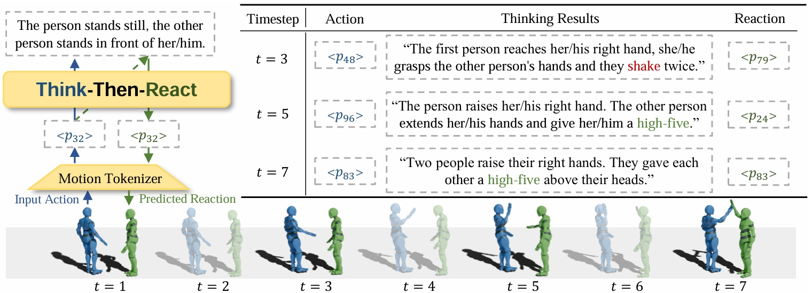

# [ICLR 2025] Think Then React: Towards Better Action-to-Reaction Motion Generation

Wenhui Tan, Boyuan Li, Chuhao Jin, Wenbing Huang, Xiting Wang, Ruihua Song @ RUC-GSAI

[Paper Link](https://openreview.net/pdf?id=UxzKcIZedp), [Project Link](Think-Then-React.github.io)

# Introduction

Given a human action as input, our Think-Then-React model first thinks by generating an action description and reasons out a reaction prompt. It then reacts to the action based on the results of this thinking process. TTR reacts in a real-time manner at every timestep and periodically

# Environment
```
pip install -r requirements.txt
```

Or just use your own pytorch environment with **transformers**, **lightning**, **smplx**, **omegaconf**, and **matplotlib** installed.

# Data
### Download Dataset
Get Inter-X-Dataset from https://github.com/liangxuy/Inter-X, and place it at ~/data/data/motion/Inter-X_Dataset.

### Preprocessing
Run all the scripts under _data_preprocessing_ sequentially, e.g., run
```
python data_preprocessing/0-smpl_to_joints3d_22.py
```
And then run
```
python data_preprocessing/1-preprocess_text.py
```

Files with indices like 0.5 and 1.5 would help you analyze and check the processed dataset. The intermidiate steps are very crucial to ensure the data is in the right format and can be used for training.

# Training

We use lightning.pytorch to train our models, Omegaconf to manage the configurations, and Tensorboard to monitor training.

### 0: Evaluation Model Training
```
python train.py --model=motion_clip --dataset=motion_clip --devices=0,1,2,3
```

### 1: Motion VQ-VAE Training
```
python train.py --model=motion_vqvae --dataset=motion_vqvae --devices=1
```

### 2: LM Pre-Training
```
python train.py --model=lm --dataset=lm --devices=0,1,2,3,4,5,6,7 stage=pretrain
```

### 3: LM Fine-Tuning
```
python train.py --model=lm --dataset=lm --devices=0,1,2,3,4,5,6,7 stage=finetune pretrained_ckpt=/path/to/your/lm/pretrained_ckpt
```

# Eval & Inference
```
python eval.py --ckpt_path=/path/to/your/ckpt
```

# Acknowledgement
We thank [MotionGPT](https://github.com/OpenMotionLab/MotionGPT) and [HumanML3D](https://github.com/EricGuo5513/HumanML3D) for their useful code for data processing.

# Citation
If you use this code base in your research, please cite our paper with the following BibTex entry:
```bibtex
@inproceedings{
    tan2025think,
    title={Think Then React: Towards Unconstrained Action-to-Reaction Motion Generation},
    author={Wenhui Tan and Boyuan Li and Chuhao Jin and Wenbing Huang and Xiting Wang and Ruihua Song},
    booktitle={The Thirteenth International Conference on Learning Representations},
    year={2025},
    url={https://openreview.net/forum?id=UxzKcIZedp}
}
```

# Licenses
This project is licensed under the MIT LICENSE - see the [LICENSE](LICENSE) file for details

Note that our code depends on other libraries, including SMPL, SMPL-X, PyTorch3D, and uses datasets which each have their own respective licenses that must also be followed.
